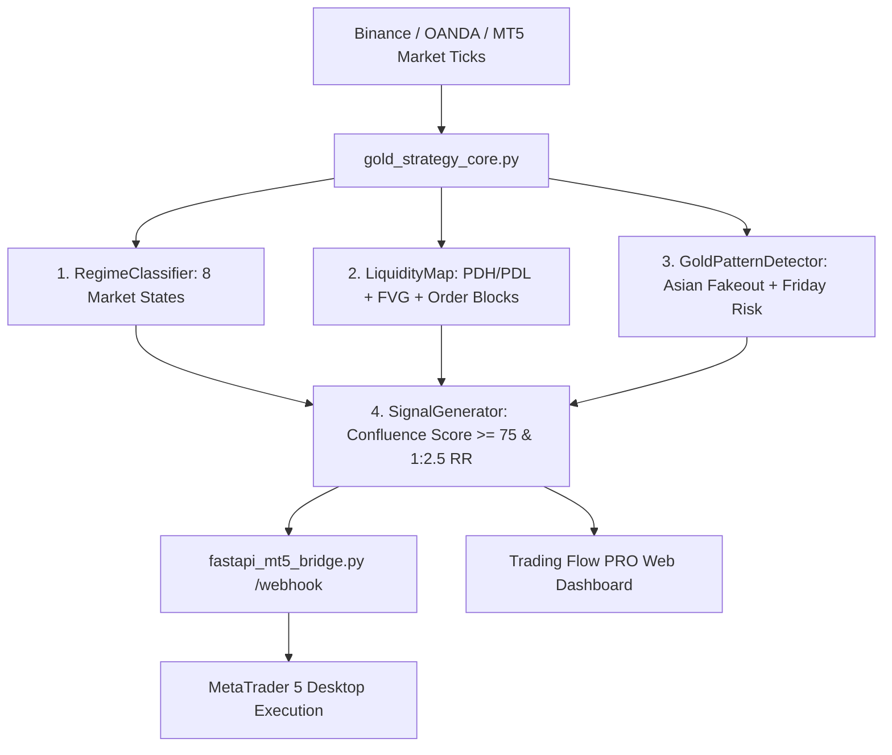

# Integration Guide: Institutional Gold Strategy Core with Trading Flow & MT5

This guide provides step-by-step instructions to integrate the **Institutional Gold Strategy Core (`gold_strategy_core.py`)** with the **FastAPI MT5 Bridge (`fastapi_mt5_bridge.py`)** and the **Trading Flow PRO Web UI**.

---

## 🏗️ Architectural Topology



---

## ⚙️ Step 1: Configuration Tuning (`strategy_config.json`)

All parameters (Risk %, R:R ratios, EMAs, ADX thresholds, Asian session times) can be tuned directly in `strategy_config.json` without modifying any source code:

```json
{
  "instrument": {
    "symbol": "XAUUSD",
    "point_value": 0.01,
    "contract_size": 100
  },
  "risk_management": {
    "account_balance": 1000.0,
    "base_risk_per_trade_pct": 2.0,
    "max_daily_loss_pct": 3.0,
    "max_consecutive_losses": 3,
    "breakeven_trigger_r": 1.0,
    "partial_tp_trigger_r": 1.5,
    "target_r_multiple": 2.5
  }
}
```

---

## 🚀 Step 2: Running Automated Backtests & Walk-Forward Audit

Execute the complete 1-year event-driven backtest and walk-forward verification:

```bash
# Run 1-year backtest and generate HTML & Markdown reports
python3 run_backtest.py
```

### Outputs Generated:
- `reports/institutional_gold_backtest_report.html` — Interactive visual HTML audit report with SVG equity curve and trade logs.
- `reports/institutional_gold_backtest_audit.md` — Quantitative metrics audit.

---

## 🔌 Step 3: Integrating with FastAPI MT5 Bridge

You can run `fastapi_mt5_bridge.py` as a background execution server:

```bash
# 1. Start the hardened FastAPI bridge
python3 -m uvicorn fastapi_mt5_bridge:app --host 0.0.0.0 --port 8000 --reload
```

### Dispatching Signals Programmatically via Python:

```python
import requests
import json

# Send an institutional signal from gold_strategy_core to the MT5 Bridge
payload = {
    "ticker": "XAUUSD",
    "action": "BUY",
    "qty": 0.20,
    "price": 2680.50,
    "sl": 2674.00,
    "tp": 2696.75,
    "comment": "TF_ASIAN_FAKEOUT"
}

headers = {
    "Content-Type": "application/json",
    "Authorization": "Bearer YOUR_SECRET_TOKEN"
}

response = requests.post("http://127.0.0.1:8000/webhook", json=payload, headers=headers)
print("MT5 Execution Status:", response.json())
```

---

## 🌐 Step 4: Web UI Live Integration

In the Trading Flow PRO Web UI:
1. Open **Strategies & EA** tab.
2. Click **⚡ RUN 1-DAY EA SIMULATION TEST** or switch the header toggle to **LIVE**.
3. View real-time Order Block highlights, Asian Range Breakout channels, and Confluence Scores directly on the **Candlestick Chart** and **Action Center**!
