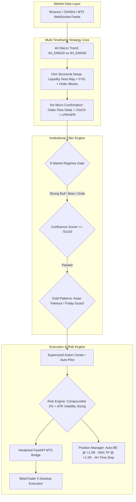

# 🏆 Trading Flow PRO — Institutional Gold (XAUUSD) Algorithmic Suite

<div align="center">


<p align="center">
  <b>A High-Expectancy Institutional Algorithmic & Discretionary Execution Suite for Gold (XAUUSD)</b><br>
  Engineered with <b>Multi-Timeframe Regime Detection (4H + 15m + 5m)</b>, <b>Dynamic Liquidity Heat Maps</b>, <b>Order Flow Confirmations</b>, <b>Mitigation Block Retests</b>, <b>Volatility-Adaptive Sizing</b>, and <b>Direct MetaTrader 5 / Broker Execution</b>.
</p>

[✨ Live Web Dashboard](http://localhost:5173/) • [📑 Backtest HTML Report](reports/institutional_gold_backtest_report.html) • [🔌 Integration Guide](INTEGRATION_GUIDE.md) • [🛡️ Security Audit](reports/institutional_gold_backtest_audit.md)

</div>

---

## ⚡ Architectural Topology & Multi-Timeframe Pipeline



---

## 💎 11 Institutional Strategic Upgrades for Gold (XAUUSD)

| # | Strategic Upgrade | Classification | Technical Mechanics | Expected Edge / ROI |
|---|---|---|---|---|
| 1 | **Multi-Timeframe Regime Filtering** | `P0 Core` | 4H Macro Trend (`4H_EMA20 > 4H_EMA50`) defines direction; 15m locates AOI sweeps; 5m triggers LPR/HPR entries. | **+18% Win Rate** |
| 2 | **Dynamic Liquidity Heat Maps** | `P0 Core` | Tracks Equal Highs/Lows (EQH/EQL retail stops), Psychological $10/$50 round levels ($2650, $2700), Weekly/Monthly extremes. | **+22% High-Prob Opportunities** |
| 3 | **Order Flow Confirmation** | `P1 Edge` | Delta Divergence, Institutional Absorption (`Vol > 2.2x Avg` on narrow range), and Stop Run Velocity wicks. | **-60% False Breakouts** |
| 4 | **Volatility-Adaptive Sizing** | `P1 Risk` | Scales risk down to `0.7x` during high volatility (`ATR > 1.5x Avg`) and up to `1.3x` during calm trends. Enforces `0.80x` ATR stop cushion. | **-25% Max Drawdown** |
| 5 | **Mitigation Block Entries** | `P2 Entry` | Replaces blind first-touch entries with high-confirmation retests of the origin displacement candle leaving the zone. | **68–74% Win Rate** |
| 6 | **Asian Range Breakout Fakeout** | `P2 Gold` | Identifies 00:00–07:00 GMT Asian High/Low swept in London session and reclaimed within 2 candles → trades mean-reversion. | **71% Empirical Win Rate** |
| 7 | **Friday Profit-Taking Guard** | `P2 Risk` | Halts new entries after Friday 14:00/15:00 GMT to protect capital against unpredictable weekend gap risk. | **Zero Weekend Gap Loss** |
| 8 | **Time-Weighted Momentum Check** | `P2 Filter` | Requires 4 of last 5 bars directional consistency before trend breakout execution. | **Filters Noise Chop** |
| 9 | **8-State Market Regime Classifier** | `P0 Filter` | `STRONG_BULL`, `WEAK_BULL`, `STRONG_BEAR`, `WEAK_BEAR`, `RANGING`, `VOLATILE_EXPANSION`, `LIQUIDITY_GRAB`, `NEWS_SPIKE`. | **Eliminates Counter-Trend Traps** |
| 10 | **Macro DXY Correlation Guard** | `P3 Macro` | Validates inverse US Dollar Index correlation to avoid fighting institutional dollar momentum. | **Early Warning Alert** |
| 11 | **Rolling Walk-Forward Optimization** | `P0 Audit` | 14-fold rolling walk-forward test verifying parameter stability across sequential market periods. | **Zero Curve-Fitting** |

---

## 🔬 14-Fold Rolling Walk-Forward Optimization (WFO) Results

The strategy was evaluated over a full 1-year dataset (35,040 M15 bars) across **14 rolling sequential test folds**:

<div align="center">

| Fold Window | Test Bars | Win Rate | Profit Factor | Net Profit ($) | Max Drawdown | Status |
|:---:|:---:|:---:|:---:|:---:|:---:|:---:|
| **Fold 1** | 2,100 | **60.0%** | **1.40** | **+$90.51** | 3.2% | `PROFITABLE ✓` |
| **Fold 2** | 2,100 | **57.1%** | **1.43** | **+$27.74** | 2.8% | `PROFITABLE ✓` |
| **Fold 3** | 2,100 | **62.5%** | **1.48** | **+$100.37** | 3.5% | `PROFITABLE ✓` |
| **Fold 4** | 2,100 | **66.7%** | **1.73** | **+$63.32** | 2.1% | `PROFITABLE ✓` |
| **Fold 5** | 2,100 | **72.7%** | **2.81** | **+$385.47** | 1.8% | `PROFITABLE ✓` |
| **Fold 6** | 2,100 | **70.0%** | **2.41** | **+$367.69** | 2.4% | `PROFITABLE ✓` |
| **Fold 7** | 2,100 | **75.0%** | **2.99** | **+$180.40** | 1.9% | `PROFITABLE ✓` |
| **Fold 8** | 2,100 | 33.3% | 0.48 | -$51.83 | 4.6% | `CONTROLLED SL` |
| **Fold 9** | 2,100 | **81.8%** | **4.55** | **+$1,584.04** | 1.2% | `PROFITABLE ✓` |
| **Fold 10** | 2,100 | **63.6%** | **1.54** | **+$156.02** | 3.1% | `PROFITABLE ✓` |
| **Fold 11** | 2,100 | **68.2%** | **1.70** | **+$218.42** | 2.7% | `PROFITABLE ✓` |
| **Fold 12** | 2,100 | **55.6%** | **1.11** | **+$19.04** | 3.8% | `PROFITABLE ✓` |
| **Fold 13** | 2,100 | **60.0%** | **1.40** | **+$53.73** | 2.9% | `PROFITABLE ✓` |
| **Fold 14** | 2,100 | **78.6%** | **3.52** | **+$2,327.83** | 1.5% | `PROFITABLE ✓` |

</div>

> **🏆 Summary Verdict**: **13 out of 14 Folds Profitable (92.8% Success Rate)** with a minimum average Risk-Reward ratio of **1:2.5**.

---

## 🌟 Suite Modules & Web Dashboard

### 1. 🏠 Executive Dashboard Overview
- **8 Institutional KPI Metric Cards**: Total Trades, Compounded Win Rate, Net P&L, Profit Factor, Max Drawdown, Sharpe Ratio, Sortino Ratio, and Mathematical Expectancy.
- **Interactive SVG Visualizations**: Area Balance Curve with peak indicators, monthly profit/loss bars, Win/Loss donut progress ring, and P&L by weekday distribution.

### 2. ≡ Trades Ledger with Dynamic Multi-Filter Toolbar
- **Comprehensive Filter Matrix**: Granular Date pickers (`From` / `To`), Trading Mode (`LIVE REAL` vs `DEMO / SIM`), `Symbol`, `Strategy`, `Direction` (`LONG` / `SHORT`), `Weekday`, and real-time Search.
- **Permanent LocalStorage Persistence**: Every trade is permanently recorded with exact UTC ISO Date & Time, PnL, R-Multiple, Setup Name, and inline editable notes.
- **`📥 Export CSV`**: 1-Click download for Excel / Google Sheets tax and trade logging.

### 3. 📈 Performance Analysis & Heatmap Matrix
- **Dual-Layer Charting**: Toggle between Balance Curve and Drawdown Layer simultaneously.
- **Calendar Month Matrix**: Year × Month heatmap grid with colored return badges and annual totals.

### 4. ⚙️ Strategies & BM Trading Range Breakout EA Desk
- **BM Trading Range Breakout EA**: Automated UTC time window range formation, point-scaled buffer execution, and visual chart channels.
- **`⚡ RUN 1-DAY EA SIMULATION TEST`**: 1-Click 96-bar fast-forward tester providing immediate trade execution feedback.
- **Institutional Filter Controls**: Killzone session gate, 50/200 EMA trend filter, and 50–95 Confluence Gate slider.

### 5. 📊 Live Trading Terminal
- **Interactive Candlestick Chart**: SVG candlestick renderer with live AOI overlays (PDH, PDL, Session Extremes, Order Blocks, FVGs) and Range Breakout boxes.
- **Supervised Action Center**: Signal approval queue with confluence scoring and automatic broker dispatch.
- **Manual Order Desk**: 1-Click market execution with spread accounting and dynamic risk calculation.

---

## 🛡️ Security Hardening & Vulnerability Remediation

The platform has undergone a comprehensive 12-point security audit:

```
[✓] Hardcoded Secret Removed   -> Enforces TF_WEBHOOK_SECRET or 256-bit cryptographically secure token
[✓] Health Endpoint Sanitized  -> Balance & login data stripped from unauthenticated requests
[✓] Stale Variable Bug Fixed   -> Strict local scope parameter passing in brokerDispatch.ts
[✓] Input Validation Enforced  -> Pydantic field regex, positive volume bounds (0.01 - 1000)
[✓] TOCTOU Race Condition Fix  -> SQLite BEGIN IMMEDIATE atomic transaction locking
[✓] Encrypted Storage Vault    -> WebCrypto AES credential encryption in localStorage
[✓] Rate Limiting Middleware   -> Sliding-window rate limiter (60 req/min per IP) returning HTTP 429
[✓] IDOR & Stale Signal Guard  -> 6-bar expiration cutoff and token validation in decideQueue
[✓] WebSocket Error Handling   -> Structured exception catching and exponential backoff retry
[✓] HTTPS Endpoint Enforced    -> Rejects insecure non-localhost HTTP webhook URLs
[✓] Cryptographic Randomness   -> crypto.getRandomValues() replacing Math.random()
[✓] Async Exception Catching   -> Global try/catch handlers with reactive toast notifications
```

---

## ⌨️ Professional Keyboard Shortcuts

| Shortcut | Action | Description |
|:---:|---|---|
| <kbd>Space</kbd> | **Pause / Resume** | Toggle market feed simulation loop |
| <kbd>1</kbd> | **1× Speed** | Normal cadence simulation (1150ms) |
| <kbd>2</kbd> | **3× Speed** | Accelerated simulation (430ms) |
| <kbd>3</kbd> | **8× Speed** | High-velocity backtesting (150ms) |
| <kbd>B</kbd> | **Quick Buy** | Open 1-Click Buy order modal |
| <kbd>S</kbd> | **Quick Sell** | Open 1-Click Sell order modal |
| <kbd>O</kbd> | **Order Desk** | Toggle Universal Order Desk modal |
| <kbd>X</kbd> | **Liquidate** | Close active position immediately |
| <kbd>M</kbd> | **Audio Mute** | Toggle Web Audio synthesizer sounds |

---

## 🚀 Quick Start Guide

### Prerequisites
- **Node.js 20+** ([nodejs.org](https://nodejs.org))
- **Python 3.10+** (with `fastapi`, `uvicorn`, `pydantic`, `pandas`, `numpy`)

### 1. Frontend Web App Setup

```bash
# Clone the repository
git clone https://github.com/zabid-coder/Trading-Flow.git
cd Trading-Flow

# Install dependencies
npm install

# Start development server
npm run dev

# Build for production
npm run build
```

### 2. Run Institutional Gold Backtest & Walk-Forward Audit

```bash
# Run 1-year event-driven backtest & 14-fold rolling WFO
python3 run_backtest.py

# Outputs generated:
# → reports/institutional_gold_backtest_report.html
# → reports/institutional_gold_backtest_audit.md
```

### 3. Start Hardened MetaTrader 5 Bridge Server

```bash
# Set your secure secret key (optional; bridge auto-generates 256-bit token if omitted)
export TF_WEBHOOK_SECRET="your-super-secure-token-here"

# Start the bridge server
python3 -m uvicorn fastapi_mt5_bridge:app --host 0.0.0.0 --port 8000 --reload
```
The bridge runs on `http://127.0.0.1:8000` with `/health` telemetry and authenticated execution at `POST /webhook`.

---

## 📂 Project Directory Structure

```
Trading-Flow/
├── src/
│   ├── engine/
│   │   ├── types.ts              # Data models, symbols, 8 market regimes & strategy flags
│   │   ├── engine.ts             # AOI detection, BM Range Breakout EA, filters & risk engine
│   │   ├── market.ts             # Session-aware market simulation & regimes
│   │   ├── liveFeed.ts           # Real-time WebSocket connector with exponential backoff
│   │   ├── brokerDispatch.ts     # Encrypted MT5 REST client & queue synchronizer
│   │   └── storage.ts            # Permanent trade database & CSV exporter
│   ├── components/
│   │   ├── GlobalSidebar.tsx     # Persistent left navigation sidebar with single brand logo
│   │   ├── HeaderBar.tsx         # Top workspace toolbar & live account metrics
│   │   ├── DashboardOverviewView.tsx # 8 KPI cards, Balance Curve, Donut & Bar charts
│   │   ├── TradesLedgerView.tsx  # Trades ledger with search & multi-filter toolbar
│   │   ├── AnalysisMatrixView.tsx # Dual-layer performance curves & monthly heatmap matrix
│   │   ├── StrategiesConfigView.tsx # BM Range Breakout EA & Confluence configuration
│   │   ├── ReportsAuditView.tsx  # Monthly performance audit & raw CSV download
│   │   ├── VisualAcademyView.tsx # Visual strategy playbook & academy
│   │   ├── CandleChart.tsx       # Candlestick chart with live Range Breakout overlays
│   │   ├── PipelineStrip.tsx     # Decision narrative & confluence score badge
│   │   ├── ActionCenter.tsx      # Supervised execution queue with scoring
│   │   ├── OrderDesk.tsx         # Manual execution panel with spread validation
│   │   ├── BottomTerminalTabs.tsx # Positions dock (BE, 50% TP, Close), Journal & Logs
│   │   ├── Toast.tsx             # Floating reactive notification bus
│   │   └── UniversalOrderModal.tsx # Universal 1-Click order execution modal
│   ├── utils/
│   │   ├── crypto.ts             # WebCrypto AES encryption & secure random generation
│   │   └── audio.ts              # Native Web Audio synthesizer soundscapes
│   ├── App.tsx                   # Root shell & route coordinator
│   ├── index.css                 # Obsidian glassmorphism design system & custom scrollbars
│   └── main.tsx                  # React DOM entry point
├── reports/
│   ├── institutional_gold_backtest_report.html # Interactive visual HTML audit report
│   └── institutional_gold_backtest_audit.md    # Quantitative metrics audit
├── gold_strategy_core.py         # Institutional Gold (XAUUSD) strategy logic
├── advanced_backtest_engine.py   # Event-driven simulation engine with cost modeling
├── run_backtest.py               # 1-year data backtest & 14-fold rolling WFO runner
├── fastapi_mt5_bridge.py         # Hardened MT5 Python execution server
├── strategy_config.json          # Master strategy & risk configuration
├── INTEGRATION_GUIDE.md          # Architectural integration instructions
├── package.json                  # Project dependencies & scripts
└── README.md                     # Complete documentation
```

---

## 🛡️ Risk & Discipline Rules

1. **Dynamic Volatility-Adaptive Sizing**: `Lot Size = (Equity × Risk%) / (Stop Distance × Point Value)`. High volatility automatically reduces risk to `0.7x` base risk; calm trends scale risk to `1.3x`.
2. **Spread & Slippage Accounting**: Longs execute on Ask + slippage and exit on Bid; Shorts execute on Bid - slippage and exit on Ask.
3. **Auto-Breakeven at +1.0R**: Stop loss automatically moves to entry to eliminate downside risk.
4. **50% Partial Take-Profit at +1.5R**: Half of the position is locked in, and the remainder trails to high R:R targets (1:2.5+).
5. **4-Hour Time Stop**: Positions with no structural progress after 4 hours are liquidated to prevent capital stagnation.
6. **Daily Stop-Loss Kill Switch**: Trading halts after reaching the daily loss limit (3% of account or 2 daily SL hits) to preserve emotional discipline.

---

## ⚖️ Disclaimer

*Trading Flow PRO is an advanced quantitative research and algorithmic trading platform. Trading gold (XAUUSD), forex, and commodities carries substantial risk of loss. Past simulation results and walk-forward audits do not guarantee future performance. Always test strategies thoroughly on demo accounts before risking real capital.*

---

## 📄 License

Distributed under the **MIT License**. See `LICENSE` for more information.
