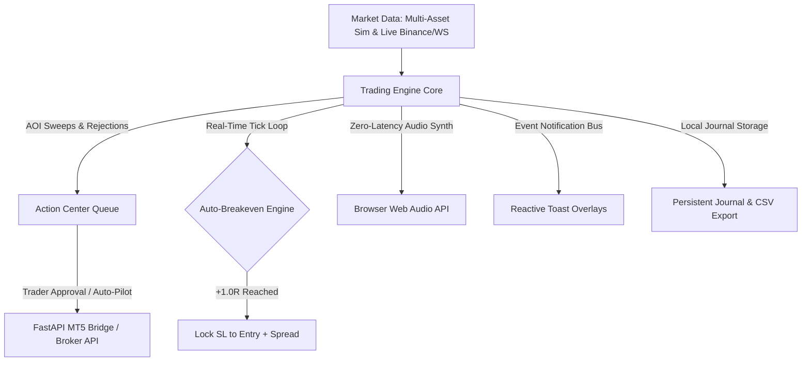

# Trading Flow — Institutional Algorithmic & Discretionary Trading Suite


A world-class, institutional-grade algorithmic trading console that bridges theoretical price-action models (liquidity traps, Area of Interest sweeps, Fair Value Gaps, rejection candles) with **sub-millisecond execution, live WebSocket market streaming, zero-latency Web Audio soundscapes, automated risk protection (Auto-Breakeven @ +1.0R, scale-outs), and real MT5 / Exness broker dispatch**.

---

## ⚡ Key Highlights & Architecture



### 1. Dual Engine Pipeline (Simulated & Live Real-Time)
- **4 Area of Interest (AOI) Families**:
  - **Previous Day High / Low (PDH / PDL)** and live current intraday extremes (CDH / CDL).
  - **Triple Tops & Triple Bottoms**: Programmatic pivot clusters with tolerance-based validation.
  - **Order Blocks & Fair Value Gaps (FVG)**: Demand/Supply zone tagging with multi-bar mitigation checks.
  - **Session Extremes**: London open/close, New York open/close, and London-NY overlap ranges.
- **Dual Identity Modes**:
  - **Reversal / Trap (Right-Side)**: Liquidity sweep outside an AOI returning on Low/High Price Rejection (`LPR`/`HPR`) candles.
  - **Breakout / Momentum (Left-Side)**: Approach compression followed by high-momentum `POWER_BULL` or `POWER_BEAR` candles.

### 2. Auto-Breakeven & 1-Click Position Management
- **Auto-Breakeven Engine**: Continually evaluates open positions on each bar and tick. Automatically adjusts the stop loss to breakeven (`entry ± halfSpread`) and marks the position risk-free when reaching `+1.0R`.
- **1-Click Execution Desk**:
  - `⚡ BE`: Instantly lock Stop Loss to entry price.
  - `💰 50% TP`: Take 50% profit, book realized balance, and scale down active risk.
  - `✕ Close`: Immediate market liquidation with spread-cost calculation.

### 3. Native Web Audio Synthesizer
- Built directly on the browser's **Web Audio API (`AudioContext`)** with zero external audio files:
  - **Signal Alert**: Ascending dual-tone chime on liquidity trap confirmation.
  - **Order Filled**: Resonant bell ding on entry dispatch.
  - **Stop Loss**: Low-frequency damped triangle thump.
  - **Take Profit**: 3-tone celebratory ascending arpeggio.
  - **Breakeven**: Crisp dual-frequency confirmation click.
- Persistent global mute toggle (`M` key or header icon).

### 4. Reactive Toast Notification System
- Floating interactive notification stack with smooth slide-in micro-badge cards for order fills, risk triggers, broker events, and live market updates.

### 5. Persistent Trade Journal & CSV Exporter
- LocalStorage persistence of all closed trades, timestamps, PnL, R-multiples, and setups.
- **Interactive Notes**: Click any trade row in the Journal to attach custom trade notes inline.
- **`📥 Export CSV`**: One-click download of your trade history for Excel, Google Sheets, or tax tracking.

### 6. Hardened FastAPI MT5 Bridge (`fastapi_mt5_bridge.py`)
- **Connection Leak Prevention**: Context-managed SQLite connection pools (`get_db()`) and async lifespan initialization.
- **Bearer Token Authentication**: Secure token verification (`verify_auth()`) protecting all webhook endpoints.
- **CORS Whitelisting**: Strict origin controls restricting API access to trusted frontend environments.
- **Atomic Dispatch Synchronization**: Action Center items transition immediately to `SENDING` before network request dispatch to eliminate double-fill race conditions.

---

## ⌨️ Professional Keyboard Shortcuts

| Shortcut | Action | Description |
|---|---|---|
| <kbd>Space</kbd> | **Pause / Resume** | Toggle market feed simulation loop |
| <kbd>1</kbd> | **1× Speed** | Normal cadence simulation (1150ms) |
| <kbd>2</kbd> | **3× Speed** | Accelerated simulation (430ms) |
| <kbd>3</kbd> | **8× Speed** | High-velocity backtesting (150ms) |
| <kbd>B</kbd> or <kbd>L</kbd> | **Order Desk (Long)** | Focus manual order panel |
| <kbd>S</kbd> | **Order Desk (Short)** | Focus manual order panel |
| <kbd>X</kbd> | **Liquidate** | Close open position immediately |
| <kbd>M</kbd> | **Audio Mute** | Toggle all synthesizer sound effects |

---

## 🚀 Quick Start Guide

### Prerequisites
- **Node.js 20+** ([nodejs.org](https://nodejs.org))
- **Python 3.10+** (if deploying the MT5 bridge on Windows)

### 1. Frontend Setup & Launch

```bash
# Clone the repository
git clone https://github.com/zabid-coder/Trading-Flow.git
cd Trading-Flow

# Install dependencies
npm install

# Start development server
npm run dev

# Build for production
npm run build
```

### 2. FastAPI MetaTrader 5 Bridge Setup (Windows / VPS)

```bash
# Navigate to project root
cd Trading-Flow

# Install Python requirements
pip install fastapi uvicorn MetaTrader5 pydantic

# Run the bridge server with Bearer Token auth
python fastapi_mt5_bridge.py
```
The bridge runs on `http://127.0.0.1:8000` with automated health check at `GET /health` and execution at `POST /webhook`.

---

## 📂 Project Directory Structure

```
Trading-Flow/
├── src/
│   ├── engine/
│   │   ├── types.ts          # Core data models, configs, symbols & timeframes
│   │   ├── engine.ts         # AOI detection, reaction filters, risk engine & auto-BE
│   │   ├── market.ts         # Session-aware market simulation & regimes
│   │   ├── liveFeed.ts       # Real-time WebSocket connector with exponential backoff
│   │   ├── brokerDispatch.ts # Authenticated MT5 REST client & queue synchronizer
│   │   └── storage.ts        # Persistent trade journal & CSV exporter
│   ├── components/
│   │   ├── CandleChart.tsx   # SVG Candlestick renderer with AOI overlays
│   │   ├── HeaderBar.tsx     # Instrument switcher, OANDA spread box, sound toggle
│   │   ├── PipelineStrip.tsx # Live bar-by-bar engine decision narrator
│   │   ├── ActionCenter.tsx  # Supervised execution queue with scoring
│   │   ├── OrderDesk.tsx     # Manual execution panel with spread validation
│   │   ├── BottomTerminalTabs.tsx # Positions, Journal, Equity Curve & Logs
│   │   ├── TradeLog.tsx      # Interactive trade journal with inline notes
│   │   ├── Toast.tsx         # Floating reactive notification bus
│   │   └── MarketWatchlist.tsx # Real-time multi-asset quotes
│   ├── utils/
│   │   └── audio.ts          # Native Web Audio synthesizer soundscapes
│   ├── App.tsx               # Root application shell, hotkeys & event coordinator
│   ├── index.css             # Institutional dark-mode design system & animations
│   └── main.tsx              # React DOM mounting
├── fastapi_mt5_bridge.py     # Hardened MT5 Python execution server
├── package.json              # Project dependencies & scripts
└── README.md                 # Complete documentation
```

---

## 🛡️ Risk & Discipline Engine Rules

1. **Explicit Point Value Sizing**: Position sizing strictly calculates unit risk as `Risk USD ÷ (Stop Distance × Point Value)`.
2. **Spread Accounting**: Longs buy on the Ask and exit on the Bid; Shorts sell on the Bid and exit on the Ask.
3. **Daily Stop-Loss Halt**: Halted trading after reaching the max daily loss limit (`maxDailySL`) to preserve mental capital.
4. **Re-Entry Lockout**: Same-bar re-entries after SL or TP are locked to eliminate revenge trading.

---

## ⚖️ Disclaimer

*Trading Flow is an advanced algorithmic software tool designed for quantitative analysis, simulation, and educational research. Trading gold (XAUUSD), forex, and cryptocurrencies involves significant risk of capital loss. Always test strategies on demo accounts before deploying real capital.*

---

## 📄 License

Distributed under the **MIT License**. See `LICENSE` for more information.
