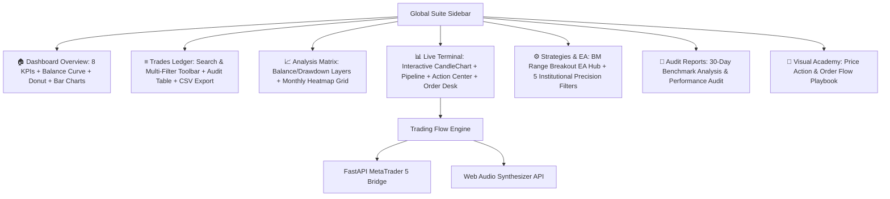

# Trading Flow PRO — Institutional Algorithmic & Discretionary Trading Suite


A world-class, institutional-grade algorithmic trading platform that merges theoretical price-action models (liquidity traps, Area of Interest sweeps, Fair Value Gaps, rejection pin bars, **BM Trading Range Breakout EA**) with **sub-millisecond execution, WebSocket streaming, zero-latency Web Audio soundscapes, automated risk protection (Auto-Breakeven @ +1.0R, scale-outs), and direct MetaTrader 5 / broker webhook execution**.

---

## ⚡ Suite Architecture & Module Overview



---

## 🌟 Core Modules

### 1. 🏠 Executive Dashboard Overview
- **8 Institutional KPI Metric Cards**:
  - `TOTAL TRADES`: Live count + Long/Short distribution.
  - `WIN RATE`: Win rate percentage with exact W/L breakdown.
  - `NET P&L`: Total compounded dollar return + Average P&L per trade.
  - `PROFIT FACTOR`: Gross Win / Gross Loss ratio.
  - `MAX DRAWDOWN`: Peak-to-trough dollar drawdown + Recovery factor.
  - `SHARPE RATIO`: Annualized risk-adjusted return ratio.
  - `AVG WIN / LOSS`: Average winning trade vs. average losing trade.
  - `EXPECTANCY`: Mathematical expected dollar value per trade entry.
- **High-Resolution Visualizations**:
  - **Balance Curve**: SVG area chart with blue gradient fill, peak indicators, and grid lines.
  - **P&L by Month**: Green profit and red loss bar chart with zero-centered baseline.
  - **Win / Loss Donut Chart**: Mathematical SVG progress ring with centered win rate percentage.
  - **P&L by Setup**: Split horizontal bi-directional bar chart categorizing returns by strategy.
  - **P&L by Weekday**: Mon–Sun return distribution vertical bar chart.

### 2. ≡ Trades Ledger with Dynamic Multi-Filter Toolbar
- **Interactive Filter Bar**:
  - `FROM` / `TO`: Granular date range pickers.
  - `SYMBOL`: Dropdown filter (`All`, `XAUUSD`, `BTCUSD`, `EURUSD`, `US30`, `USTEC`).
  - `STRATEGY`: Dynamic setup filter.
  - `DIRECTION`: Direction filter (`All`, `LONG`, `SHORT`).
  - `WEEKDAY`: Session day filter (`Mon`–`Fri`).
  - `SEARCH`: Instant search by ticket number, setup name, or user notes.
  - `Clear Filters`: 1-click reset of all active filters.
  - `📥 Export CSV`: Download filtered trade history directly to spreadsheet CSV.
- **Data Table**: Ticket #, Symbol, Direction badge, Volume (oz/lots), Open/Close Time (UTC), Open/Close Price, Outcome badge, R-Multiple, Net Profit, Strategy, and Inline Editable Notes.

### 3. 📈 Performance Analysis & Heatmap Matrix
- **Dual-Layer Performance Chart**: Toggle **Balance Curve** and **Drawdown Layer** simultaneously to audit equity drawdown depth.
- **Monthly P&L Heatmap Matrix**: Calendar matrix (Year × Month) displaying percentage and dollar returns per calendar month with green/red badges and annual totals.

### 4. ⚙️ Strategies & BM Trading Range Breakout EA Desk
- **BM Trading Range Breakout EA**:
  - `Range Start Time (UTC)`: Hour & Minute for the range to begin forming.
  - `Range End Time (UTC)`: Hour & Minute when the high/low range is locked and pending breakout orders are armed.
  - `Order Buffer (Points)`: Point distance beyond the range high/low for breakout entry triggers (e.g. 20 points = $0.20 on Gold).
  - `Live EA State Machine`: Real-time visual tracking of `WAITING` → `FORMING` → `ACTIVE` → `DONE`.
  - `⚡ RUN 1-DAY EA SIMULATION TEST`: 1-Click fast-forward simulation (96 bars) to immediately test and verify EA breakout entries.
- **5 Institutional Precision Filters**:
  1. **Killzone Session Gate**: Restricts entries to London (07:00–12:00 UTC) and New York (13:00–17:00 UTC) high-liquidity sessions.
  2. **50/200 EMA Trend Regime Filter**: Blocks counter-trend entries against established macro trends.
  3. **Confluence Gate Slider**: Sets minimum score threshold (50–95 / 100 points) for signal execution.
  4. **CDH/CDL Dynamic Noise Elimination**: Prevents chasing intra-day drifting extremes.
  5. **FVG + Order Block Displacement Validator**: Rejects naked order block touches without verified 3-bar Fair Value Gap displacement.
- **Core Price Action Strategies**: Sweep Reversal, FVG Retest, Session Breakout, EMA Pullback, RSI Exhaustion.

### 5. 📊 Live Trading Terminal
- **Interactive CandleChart**: SVG Candlestick renderer with AOI overlays (PDH, PDL, Session Extremes, Triple Tops/Bottoms, Order Blocks) and PineScript trap signal badges.
- **Decision Pipeline Strip**: Live narrative bar displaying candle classification (LPR, HPR, Power Bull/Bear), Killzone status badge, and Confluence score badge.
- **Action Center**: Supervised execution queue with manual Approve/Reject scoring and automatic MT5 order dispatch.
- **Manual Order Desk**: 1-Click Long/Short market orders with spread accounting and dynamic risk lot calculator.
- **Bottom Terminal Tabs**: Active Positions dock (`⚡ BE`, `💰 50% TP`, `✕ Close`), Journal, Equity Curve, and Engine Logs.

---

## ⌨️ Professional Keyboard Shortcuts

| Shortcut | Action | Description |
|---|---|---|
| <kbd>Space</kbd> | **Pause / Resume** | Toggle market feed simulation loop |
| <kbd>1</kbd> | **1× Speed** | Normal cadence simulation (1150ms) |
| <kbd>2</kbd> | **3× Speed** | Accelerated simulation (430ms) |
| <kbd>3</kbd> | **8× Speed** | High-velocity backtesting (150ms) |
| <kbd>B</kbd> | **Quick Buy** | Open 1-Click Buy order modal |
| <kbd>S</kbd> | **Quick Sell** | Open 1-Click Sell order modal |
| <kbd>O</kbd> | **Order Desk** | Toggle Universal Order Desk modal |
| <kbd>X</kbd> | **Liquidate** | Close active position immediately |
| <kbd>M</kbd> | **Audio Mute** | Toggle Web Audio synthesizer sounds |

---

## 🚀 Quick Start Guide

### Prerequisites
- **Node.js 20+** ([nodejs.org](https://nodejs.org))
- **Python 3.10+** (for MetaTrader 5 bridge deployment)

### 1. Frontend Setup & Launch

```bash
# Clone the repository
git clone https://github.com/zabid-coder/Trading-Flow.git
cd Trading-Flow

# Install dependencies
npm install

# Start development server
npm run dev

# Build for production
npm run build
```

### 2. Run 30-Day Backtest Simulation

```bash
# Run the institutional simulation with all filters active
npx tsx scripts/run_sim.ts

# Outputs generated:
# → reports/monthly_trade_log_analysis.csv
# → reports/monthly_performance_audit.md
```

### 3. FastAPI MetaTrader 5 Bridge Setup (Windows / VPS)

```bash
# Navigate to project root
cd Trading-Flow

# Install Python requirements
pip install fastapi uvicorn MetaTrader5 pydantic

# Run the bridge server with Bearer Token auth
python fastapi_mt5_bridge.py
```
The bridge runs on `http://127.0.0.1:8000` with automated health check at `GET /health` and execution at `POST /webhook`.

---

## 📂 Project Directory Structure

```
Trading-Flow/
├── src/
│   ├── engine/
│   │   ├── types.ts              # Data models, configs, symbols, strategy flags & views
│   │   ├── engine.ts             # AOI detection, BM Range Breakout EA, filters & risk engine
│   │   ├── market.ts             # Session-aware market simulation & regimes
│   │   ├── liveFeed.ts           # Real-time WebSocket connector with exponential backoff
│   │   ├── brokerDispatch.ts     # Authenticated MT5 REST client & queue synchronizer
│   │   └── storage.ts            # Persistent trade journal, notes & CSV exporter
│   ├── components/
│   │   ├── GlobalSidebar.tsx     # Persistent left navigation sidebar
│   │   ├── HeaderBar.tsx         # Top execution toolbar & market status
│   │   ├── DashboardOverviewView.tsx # 8 KPI cards, Balance Curve, Donut & Bar charts
│   │   ├── TradesLedgerView.tsx  # Trades ledger with search & multi-filter toolbar
│   │   ├── AnalysisMatrixView.tsx # Balance/Drawdown curves & monthly heatmap matrix
│   │   ├── StrategiesConfigView.tsx # BM Range Breakout EA & Confluence configuration
│   │   ├── ReportsAuditView.tsx  # Monthly performance audit & raw CSV download
│   │   ├── VisualAcademyView.tsx # Visual strategy playbook & academy
│   │   ├── CandleChart.tsx       # SVG Candlestick renderer with AOI & signal overlays
│   │   ├── PipelineStrip.tsx     # Live decision narrative & confluence score badge
│   │   ├── ActionCenter.tsx      # Supervised execution queue with scoring
│   │   ├── OrderDesk.tsx         # Manual execution panel with spread validation
│   │   ├── BottomTerminalTabs.tsx # Positions, Journal, Equity Curve & Logs
│   │   ├── Toast.tsx             # Floating reactive notification bus
│   │   └── UniversalOrderModal.tsx # Universal 1-Click order execution modal
│   ├── utils/
│   │   └── audio.ts              # Native Web Audio synthesizer soundscapes
│   ├── App.tsx                   # Root shell & route coordinator
│   ├── index.css                 # Obsidian glassmorphism design system
│   └── main.tsx                  # React DOM entry point
├── scripts/
│   └── run_sim.ts                # 30-day backtest simulation runner
├── reports/
│   ├── monthly_trade_log_analysis.csv # Raw trade data export
│   └── monthly_performance_audit.md   # Executive performance audit
├── fastapi_mt5_bridge.py         # Hardened MT5 Python execution server
├── package.json                  # Project dependencies & scripts
└── README.md                     # Complete documentation
```

---

## 🛡️ Risk & Discipline Engine Rules

1. **Dynamic Equity Sizing**: Unit risk = `2% of current equity ÷ (Stop Distance × Point Value)` — compounds automatically on account growth and protects capital during drawdowns.
2. **Spread Accounting**: Longs execute on Ask and exit on Bid; Shorts execute on Bid and exit on Ask.
3. **Daily Stop-Loss Halt**: Engine halts trading after reaching the max daily loss limit (`maxDailySL = 2`) to eliminate emotional churn.
4. **Re-Entry Lockout**: Same-bar re-entries after SL or TP are locked to eliminate revenge trading.
5. **Range Breakout Discipline**: Time-bounded range formation with automated pending order execution and opposing range stop loss placement.
6. **Killzone Enforcement**: All entries restricted to London (07:00–12:00 UTC) and New York (13:00–17:00 UTC) sessions.
7. **Confluence Gate**: Signals scoring below `75/100` institutional confluence points are discarded.

---

## ⚖️ Disclaimer

*Trading Flow is an advanced algorithmic software tool designed for quantitative analysis, simulation, and educational research. Trading gold (XAUUSD), forex, and cryptocurrencies involves significant risk of capital loss. Past simulation results do not guarantee future performance. Always test strategies on demo accounts before deploying real capital.*

---

## 📄 License

Distributed under the **MIT License**. See `LICENSE` for more information.
